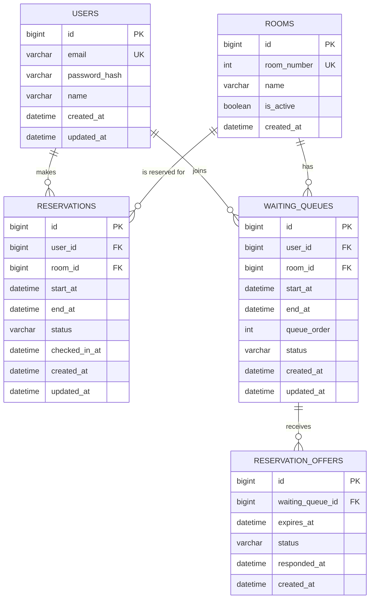

```mermaid
erDiagram
    USERS ||--o{ RESERVATIONS : "makes"
    ROOMS ||--o{ RESERVATIONS : "is reserved for"
    USERS ||--o{ WAITING_QUEUES : "joins"
    ROOMS ||--o{ WAITING_QUEUES : "has"
    WAITING_QUEUES ||--o{ RESERVATION_OFFERS : "receives"

    USERS {
        bigint id PK
        varchar email UK
        varchar password_hash
        varchar name
        datetime created_at
        datetime updated_at
    }

    ROOMS {
        bigint id PK
        int room_number UK
        varchar name
        boolean is_active
        datetime created_at
    }

    RESERVATIONS {
        bigint id PK
        bigint user_id FK
        bigint room_id FK
        datetime start_at
        datetime end_at
        varchar status
        datetime checked_in_at
        datetime created_at
        datetime updated_at
    }

    WAITING_QUEUES {
        bigint id PK
        bigint user_id FK
        bigint room_id FK
        datetime start_at
        datetime end_at
        int queue_order
        varchar status
        datetime created_at
        datetime updated_at
    }

    RESERVATION_OFFERS {
        bigint id PK
        bigint waiting_queue_id FK
        datetime expires_at
        varchar status
        datetime responded_at
        datetime created_at
    }
```